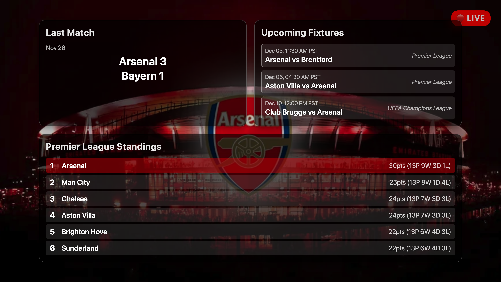
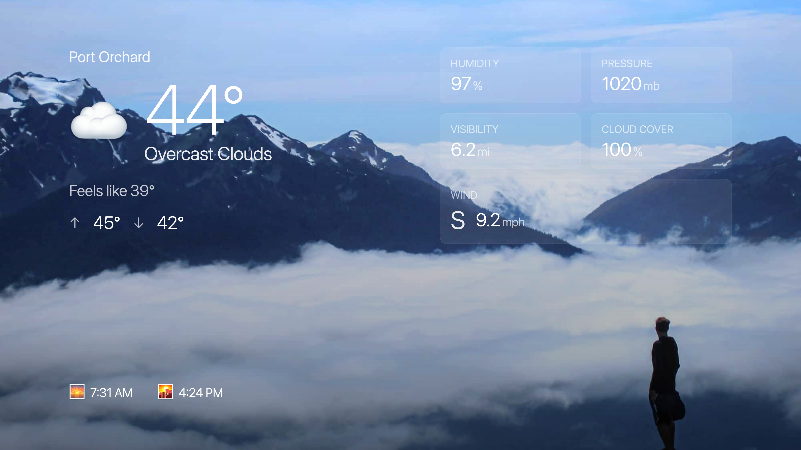
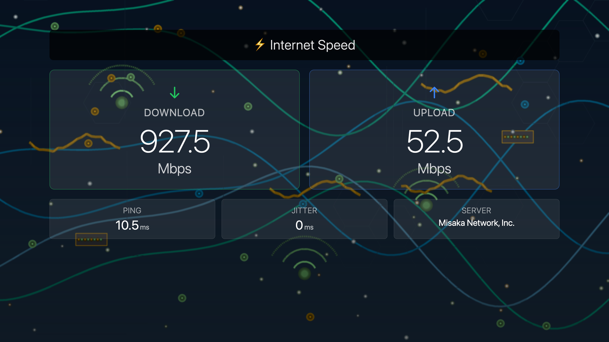

# Samsung Frame TV Signage

[](https://github.com/simonpo/signage/actions/workflows/ci.yml)
[](https://github.com/simonpo/signage/actions/workflows/ci.yml)
[](https://codecov.io/gh/simonpo/signage)
[](https://github.com/psf/black)
[](https://opensource.org/licenses/MIT)
[](https://www.python.org/downloads/)

Generate data-driven images for Samsung Frame TVs in Art Mode. Fetch live data from weather APIs, ferry schedules, sports scores, Tesla vehicles, and more, then render them as beautiful 4K images to display on your TV.

## What it does

This system pulls data from various sources and creates custom signage images. Each image combines your data with a background (local photos, gradient, or API-sourced) and renders it at 3840×2160 for Samsung Frame TVs.

### Sports Scores

Live scores and fixtures for your favourite teams. Supports Premier League football (via football-data.org) and NFL (via ESPN). Features dynamic team-specific backgrounds with fallback to generic sport backgrounds, and context-aware headings (e.g., "NFC West Standings" for NFL divisions).



### Tesla Vehicle Status

Live data from your Tesla via Fleet API: battery level, range, charging status, climate control, locks, and more. Modern HTML-rendered dashboard with comprehensive vehicle metrics.


### Weather Display

Comprehensive weather dashboard with dynamic icons and day/night awareness. Shows current conditions with weather-appropriate icons (🌫️ for fog, 🌙 for clear nights), temperature, feels-like, high/low, humidity, pressure, wind with compass direction, cloudiness, visibility, and sunrise/sunset times from OpenWeatherMap. Features dynamic backgrounds that match current weather conditions.



### Ferry Schedule

Live departure times for Washington State Ferries (currently Fauntleroy-Southworth route).


### Ferry Map

Real-time positions of all Washington State Ferry vessels on a satellite map view. Shows live vessel locations, headings, and current routes across Puget Sound.


### Internet Speed

Results from your local Speedtest tracker showing download, upload, and ping.



### Sensor Monitoring

Multi-location temperature and humidity from Ambient Weather stations (outdoor, greenhouse, chicken coop).


### Other Data Sources

- **Stock quotes** with daily change indicators
- **Ambient weather** personal station dashboard with outdoor conditions, barometric pressure, UV index, solar radiation, wind, and rain data

## Requirements

**Python Version**: 3.11 or later

The project uses a `.python-version` file (currently 3.11.11) for version managers like `pyenv` or `asdf`. CI tests run on Python 3.11 and 3.12.

**Dependencies**: Managed via `requirements.txt` (production) and `requirements-dev.txt` (development)
- All dependencies are pinned to exact versions for reproducible builds
- Security auditing via `pip-audit` in CI/CD pipeline

**Other Requirements**:
- Playwright (installed automatically via setup script)
- Samsung Frame TV (2024+ models tested)
- API keys for your chosen data sources

## Installation

### Quick Start with Docker (Recommended)

The easiest way to run the signage system is with Docker:

```bash
git clone https://github.com/simonpo/signage.git
cd signage
cp .env.example .env
nano .env  # Add your API keys
docker-compose up -d
```

See [DOCKER.md](DOCKER.md) for comprehensive Docker deployment guide, including Proxmox LXC, Raspberry Pi, and NAS setup.

### Native Python Installation

Clone the repository and run the setup script:

```bash
git clone https://github.com/simonpo/signage.git
cd signage
./scripts/setup.sh
```

This creates a Python virtual environment and installs all dependencies, including Playwright for HTML rendering.

#### Manual Installation

If you prefer manual setup:

```bash
# Create virtual environment
python3 -m venv venv
source venv/bin/activate  # On Windows: venv\Scripts\activate

# Install production dependencies
pip install -r requirements.txt

# OR install with development tools (for contributors)
pip install -r requirements-dev.txt

# Install Playwright browsers
playwright install chromium
```

### Dependency Management

The project uses **exact version pinning** for all dependencies:
- **requirements.txt**: Production dependencies only (deploy to servers)
- **requirements-dev.txt**: Includes production deps + development tools (black, ruff, pytest, etc.)

This ensures reproducible builds across all environments and CI/CD pipelines.

**Security**: All dependencies are audited for CVEs via `pip-audit` in the CI pipeline.

## Configuration

Copy the example environment file and edit it with your details:

```bash
cp .env.example .env
nano .env  # or use your preferred editor
```

The `.env` file stores all your API keys, credentials, and settings. It's excluded from git to keep your secrets safe.

**Note**: The project also supports a `sources.yaml` configuration file for advanced scheduling and multi-source setups. See `examples/sources.yaml` for reference.

### Key Configuration Settings

#### Weather (Required for basic functionality)
```bash
WEATHER_API_KEY=your_openweathermap_key
WEATHER_CITY=Seattle,US
WEATHER_BG_MODE=local  # or: pexels, unsplash, gradient
```

#### Optional Data Sources

**Tesla Fleet API**:
```bash
TESLA_CLIENT_ID=your_client_id
TESLA_CLIENT_SECRET=your_client_secret
TESLA_REGION=na  # Options: na (North America), eu (Europe), cn (China)
```

**Ambient Weather Personal Station**:
```bash
AMBIENT_API_KEY=your_ambient_api_key
AMBIENT_APP_KEY=your_ambient_application_key
AMBIENT_SENSOR_NAMES={}  # JSON map of sensor channels to names
```

**Sports** (football-data.org for football, ESPN for NFL):
```bash
FOOTBALL_API_KEY=your_key
ARSENAL_ENABLED=true
ARSENAL_TEAM_ID=57
SEAHAWKS_ENABLED=false
```

**Ferry Schedules** (Washington State Ferries):
```bash
FERRY_ROUTE=Fauntleroy-Southworth
FERRY_HOME_TERMINAL=Southworth
WSDOT_API_KEY=your_wsdot_api_key  # Optional
```

**Speedtest Tracker**:
```bash
SPEEDTEST_URL=http://192.168.1.XX:8765
SPEEDTEST_TOKEN=your_speedtest_token
```

**Stock Quotes** (Alpha Vantage):
```bash
STOCK_API_KEY=your_alphavantage_api_key
STOCK_SYMBOL=AAPL
```

#### Background Options

Each data source can specify its own background mode using `*_BG_MODE` variables:

```bash
WEATHER_BG_MODE=local
SPEEDTEST_BG_MODE=local
STOCK_BG_MODE=gradient
# ... etc for each source
```

- `local`: Use images from `backgrounds/` directories (organized by source name)
- `pexels`: Fetch from Pexels API (requires `PEXELS_API_KEY`)
- `unsplash`: Fetch from Unsplash API (requires `UNSPLASH_API_KEY`)
- `gradient`: Generate simple gradients

For API-based backgrounds:
```bash
PEXELS_API_KEY=your_pexels_api_key
UNSPLASH_API_KEY=your_unsplash_access_key
```

#### Rendering Mode

The project uses HTML rendering by default (via Playwright). You can force rendering mode with command-line flags:

```bash
# Force HTML rendering (default)
python generate_signage.py --source weather --html

# Force legacy PIL rendering
python generate_signage.py --source weather --pil
```

HTML rendering produces better typography and more flexible layouts. PIL rendering is retained for compatibility.

## Usage

Activate the virtual environment:

```bash
source venv/bin/activate  # On Windows: venv\Scripts\activate
```

Generate an image for a specific source:

```bash
python generate_signage.py --source weather
python generate_signage.py --source ferry
python generate_signage.py --source speedtest
python generate_signage.py --source sensors
python generate_signage.py --source stock
python generate_signage.py --source arsenal
python generate_signage.py --source tesla
```

Use `--html` flag to force HTML rendering (or `--pil` for legacy mode):

```bash
python generate_signage.py --source weather --html
```

Generate all enabled topics:

```bash
python generate_signage.py --source all
```

Images are saved to `art_folder/` with simple filenames like `weather.png`, `ferry.png`, etc. Each generation overwrites the previous version.

## Uploading to your TV

The `upload_to_frame.py` script uploads new images to your Samsung Frame TV via the SmartThings API.

Configure your TV details in `.env`:

```bash
TV_IP=192.168.1.100
TV_PORT=8002
```

Run the upload script:

```bash
python upload_to_frame.py
```

The script tracks which files have been uploaded in `uploaded.json` and only sends new images. It automatically cleans up old artworks, keeping the last 100.

First run will prompt you to accept the connection on your TV.

## Automation

Set up cron jobs to generate images automatically:

```bash
./scripts/setup_cron.sh
```

Edit the script first to choose which topics to generate and how often. The default updates weather every 30 minutes and ferry schedules every 15 minutes.

## Project Structure

```
src/
  clients/        API clients for external data sources
  models/         Data models and signage content definitions
  renderers/      HTML and PIL rendering engines
  backgrounds/    Background image providers
  utils/          File management, caching, image utilities
  templates/      Jinja2 templates for HTML layouts

backgrounds/      Local background images organised by topic
art_folder/       Generated output images (gitignored except samples)
scripts/          Setup and automation scripts
tests/            Test suite
```

## How it Works

1. **Data collection**: Clients fetch data from APIs or local sources
2. **Model conversion**: Raw data becomes structured SignageContent objects
3. **Background selection**: Provider chooses or generates a background image (weather-aware for conditions)
4. **Rendering**: Template engine (HTML/CSS or PIL) combines data with background
5. **Output**: 3840×2160 PNG saved to `art_folder/`

The HTML rendering path uses Playwright to render Jinja2 templates with CSS styling, then captures them as high-resolution screenshots. This produces better text quality and more flexible layouts than the legacy PIL approach.

### Intelligent Features

- **Weather-aware backgrounds**: Automatically selects appropriate backgrounds based on conditions (sunny, rainy, cloudy, etc.)
- **Nighttime detection**: Ambient weather uses solar radiation data to switch to night backgrounds
- **Smart caching**: Reduces API calls while keeping data fresh

## Contributing

See [CONTRIBUTING.md](CONTRIBUTING.md) for development setup, coding standards, and contribution guidelines.

**For Contributors**: Install development dependencies with `pip install -r requirements-dev.txt` to get all formatting, linting, and testing tools.

## Credits

Uses [Nick Waterton's samsung-tv-ws-api fork](https://github.com/NickWaterton/samsung-tv-ws-api) for uploads to 2024+ Frame TVs.

Weather data from [OpenWeatherMap](https://openweathermap.org/).

Ferry data from [Washington State Department of Transportation](https://www.wsdot.wa.gov/ferries/).

Football data from [football-data.org](https://www.football-data.org/).

## Documentation

- [ROADMAP.md](ROADMAP.md) - Project roadmap and planned features
- [DOCKER.md](DOCKER.md) - Docker deployment guide
- [CONTRIBUTING.md](CONTRIBUTING.md) - Development and contribution guidelines
- [Architecture Decision Records](docs/adr/) - Design decisions and rationale

# Branch Protection
This repository has branch protection enabled on main.
